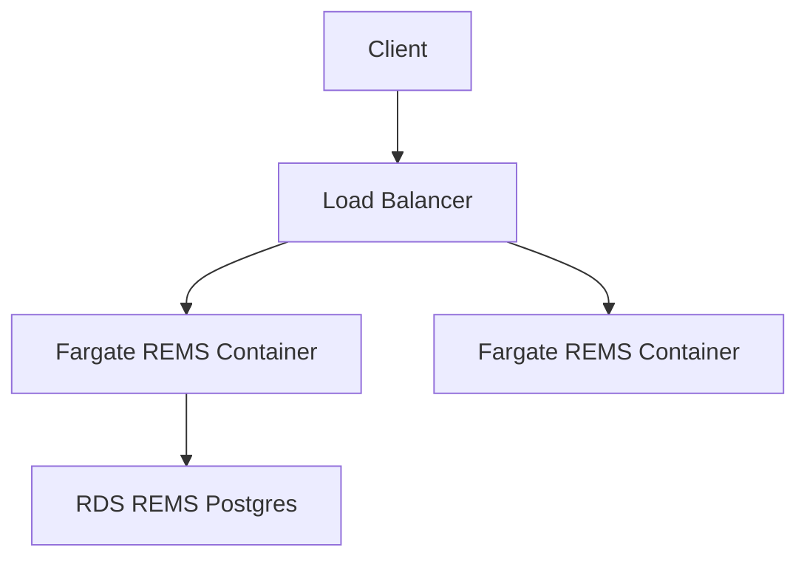

# REMS

A CDK stack and Dockerfile for deploying REMS using configuration
suitable for UMCCR.

The CDK stack sets up a standalone VPC with REMS Docker images
running in Fargate in a private subnet. Access is then provided
on an SSL application load balancer. The CDK stack can be deployed,
destroyed etc using `rems-cdk.sh`.

A lambda is also created for easy execution of REMS control 'cmds'
such as "migrate" etc - and this lambda can be launched from the
accompanying `rems-cmd.sh`.

## AWS

A new standalone VPC is created for this deployment (this could
be changed if desired).

The load balancer is created in the public subnet, and all other
activity (lambdas, fargate, rds) occurs in the private subnet.

## Useful commands

### CDK

`rems-cdk` is a lightweight wrapper around `cdk` that also sets
REMS configuration settings using parameter store etc. Other than
passing in these settings, its usage is identical to regular `cdk`.

- `./rems-cdk deploy` deploy this stack to your default AWS account/region
- `./rems-cdk diff` compare deployed stack with current state

### REMS

For details of the CMDs that work with REMS - see

https://github.com/CSCfi/rems/blob/master/src/clj/rems/standalone.clj

(the 'help' output)

Some examples are

- `./rems-cmd "migrate"`
- `./rems-cmd "list-users"`
- `./rems-cmd "grant-role owner abcdefg;list-users"`
